# A goto cosmos wallet.

Keplr is one of the widely used wallets in the cosmos ecosystem. It's non-costodial, means no-one from the team, community can have access to your funds.

# Before you start

- Keplr extension is officially supported only on Chrome.
  - It can also be used on Brave, but some features may be unavailable.
  - It isn’t possible to use Keplr extension from mobile.
- Pay attention to the websites you connect your Keplr wallet to and only download Keplr from the official website or from the link you can find in this tutorial. The same principle applies to any other wallet.
- No one from Cosmos and Keplr team will ever write you in a DM asking to validate your wallet or type your mnemonics:
  - Please be careful of scammers and if you need help always use public channels.
  - You are your own bank: help us in assisting you in keeping it safe.

# Setup Keplr Wallet
## How to install Keplr
- Go to this [link](https://chrome.google.com/webstore/detail/keplr/dmkamcknogkgcdfhhbddcghachkejeap?hl=en) and click the [Add to Chrome] button
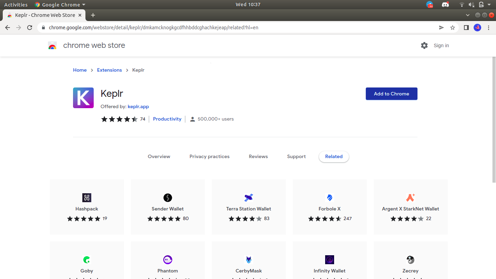

- [Add “Keplr”] window will show off. Here you have to choose [Add Extension]
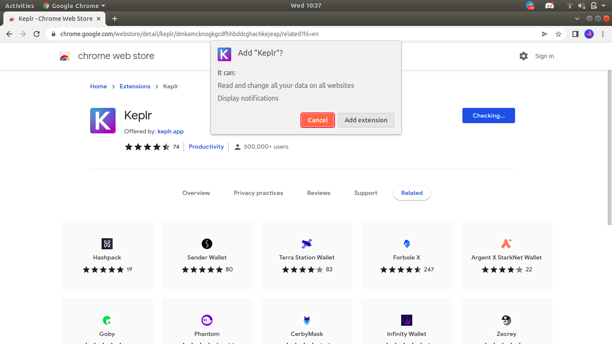

- Once after the installation process completes, it shows `sync` across devices. You can skip it
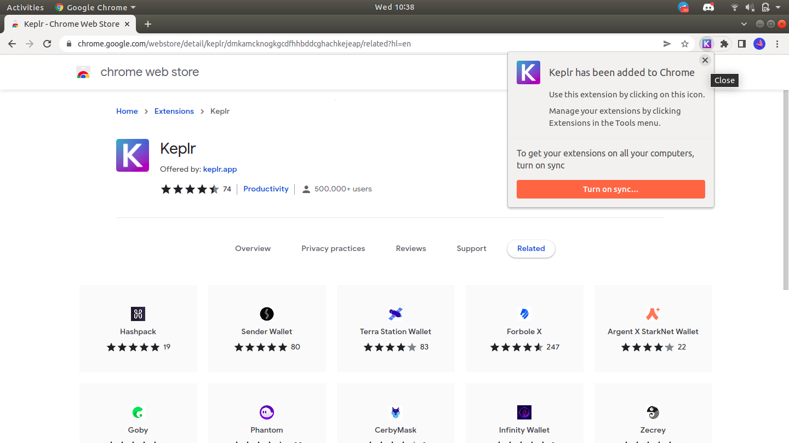

- You can start to interact with your browser extension by clicking on it.
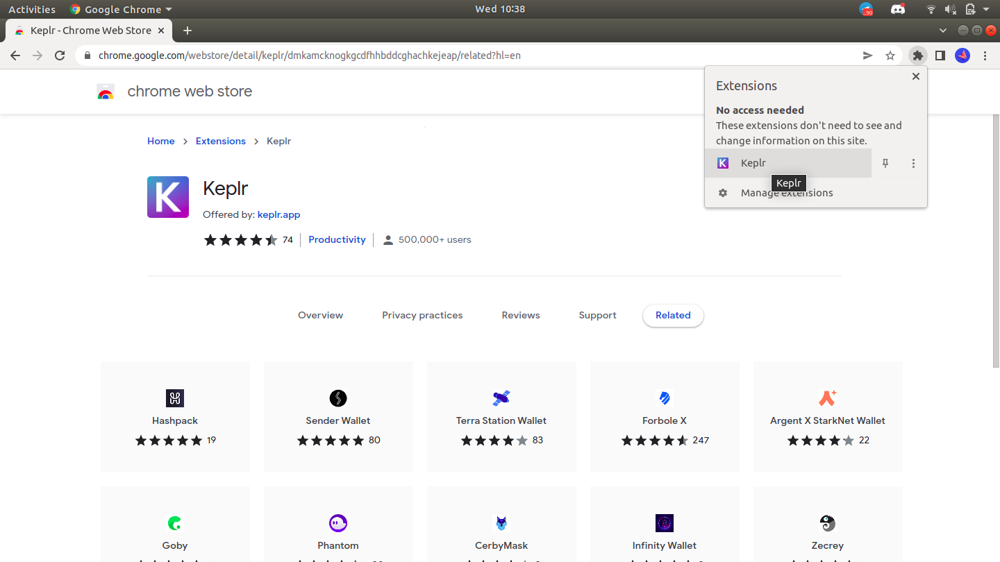

## How to create a Keplr account
### Option-1: Create a brand new account

- If you are setting up Keplr for the first time:
In the initial pop-up window, choose [Create New Account]
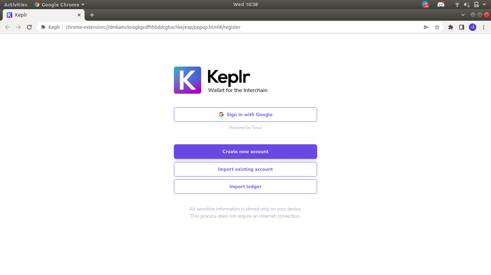

- If you have used Keplr before:
In the extension click on the silhouette in the upper-right corner, then the blue box [Add Account] & select [Create New Account]
- Choose to have a seed/mnemonic phrase of 24 words, then take care to save them.
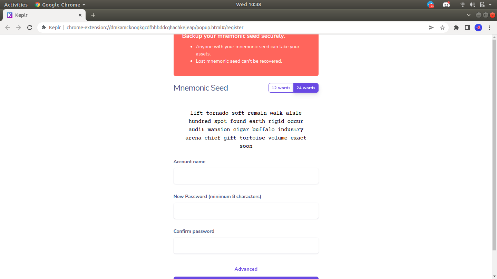

- The safest way is to write the words on paper and store them in a secure place. Avoid taking screenshots of the words or copying them into your computer/phone notes. 
- Now enter a name for your account (you can change it later), password and confirm password. Once you are sure that you have correctly transcribed the seed/mnemonic phrase, click on [Next].

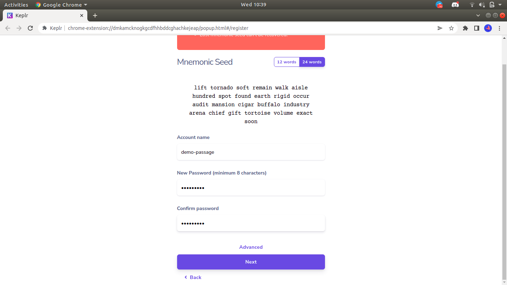

- To confirm the creation of the new account, all you have to do is click on the words in the right order in which they appear in your seed/mnemonic phrase and press [Register].

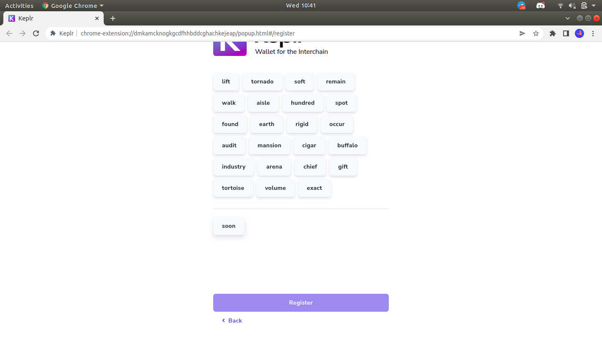

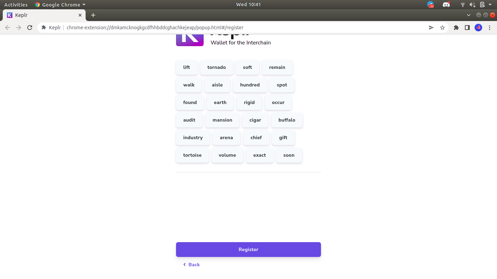

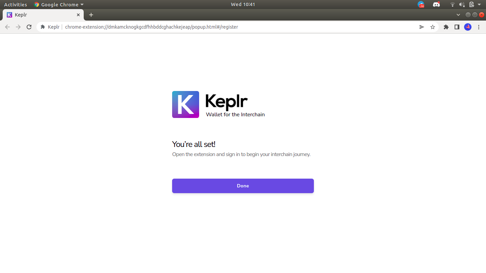

- You can view your [Keplr wallet] now
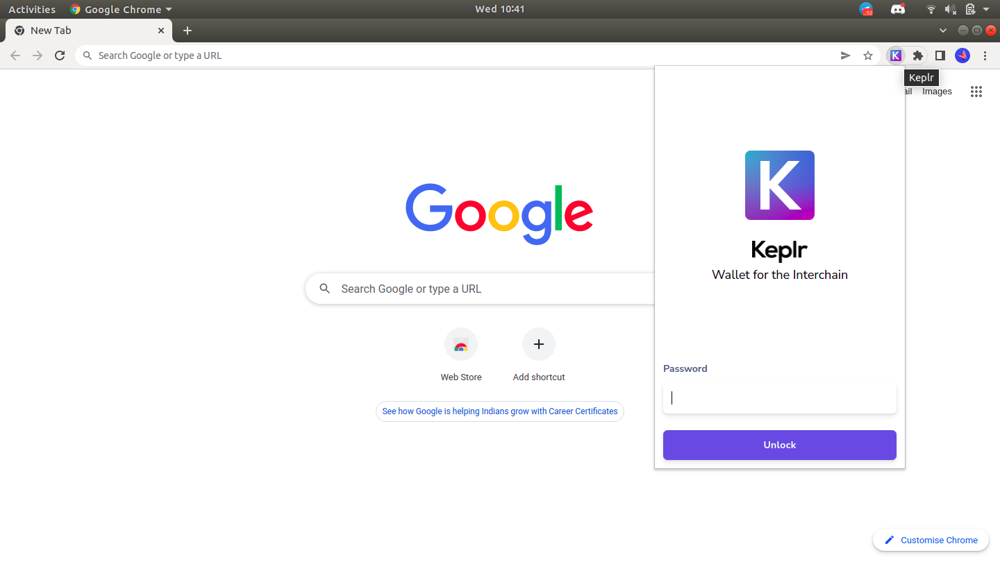
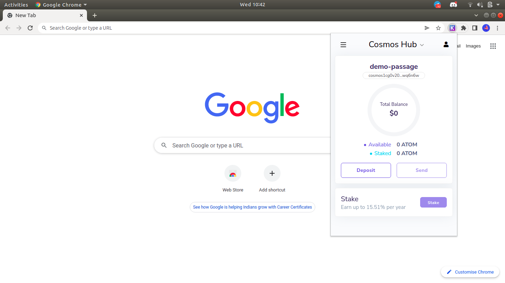

### Option-2: Import an existing account
- If you are setting up Keplr for the first time:
In the initial pop-up window, choose [Import Existing Account]
- If you have used Keplr before:
In the extension click on the silhouette in the upper-right corner, then the blue box [Add Account] & select [Import Existing Account]
- Enter your mnemonic/seed phrase in the appropriate slot, separating the words by space & taking care to check that they are spelled correctly.
- Make sure you have imported the account with the correct derivation path, viewable by clicking on [Advanced].
- If you have just downloaded Keplr extension, it’s time to set your password! Choose carefully, if possible prefer a password you’re not using in any other application, and then click [Confirm].
- If you have used Keplr before, this step will be skipped as you have already set your password when creating/importing your first account.
- Select [Done].

### Option-3: Import account from ledger
- If you are setting up Keplr for the first time:
In the initial pop-up window, choose [Import Ledger]
- If you have used Keplr before:
In the extension click on the silhouette in the upper-right corner, then the blue box [Add Account] & select [Import Ledger]
- To complete the connection with your Ledger Nano Hard Wallet, follow the steps described in the pop-up that will appear (you can find a detailed tutorial here).
- If you have just downloaded Keplr extension, it’s time to set your password! Choose carefully, if possible prefer a password you’re not using in any other application, and then click [Confirm].
- If you have used Keplr before, this step will be skipped as you have already set your password when creating/importing your first account.
- Select [Done].

# How to create/view your passage3d account

- Go to https://passage3d.vitwit.com
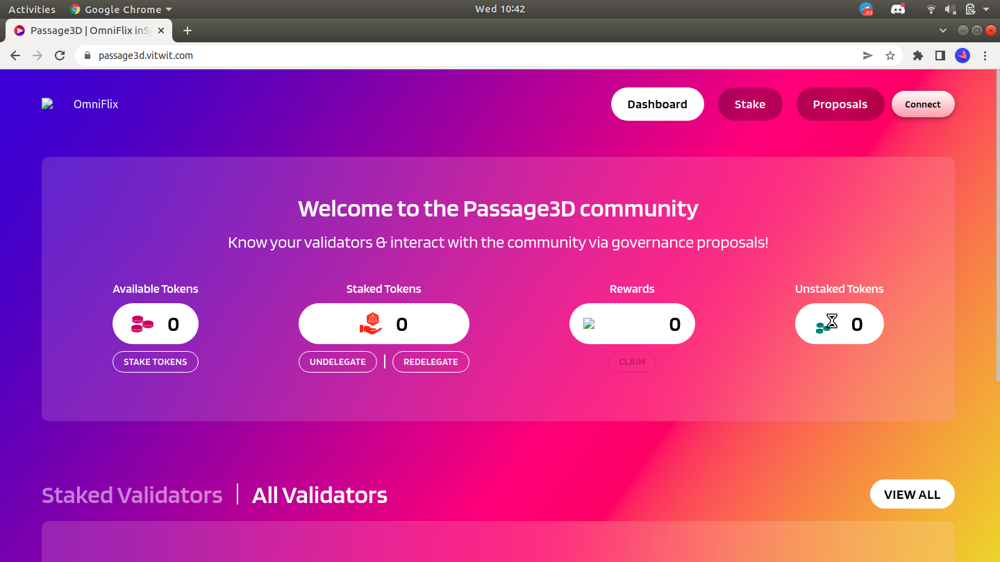

- Click on Connect on the top-right corner. It asks for [Chain Add Request], Approve it
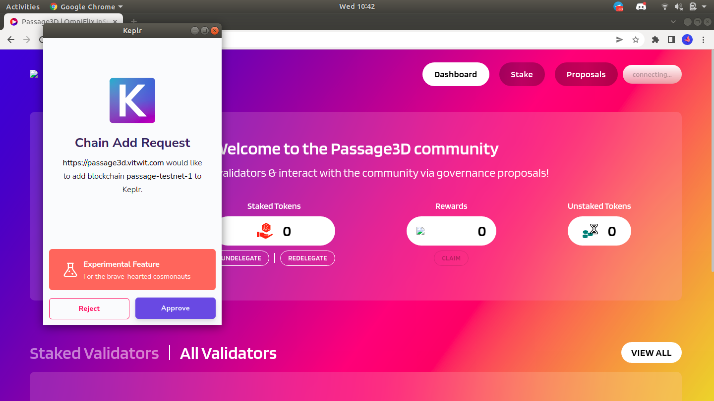

- Then it shows [Requesting Connection], Approve it
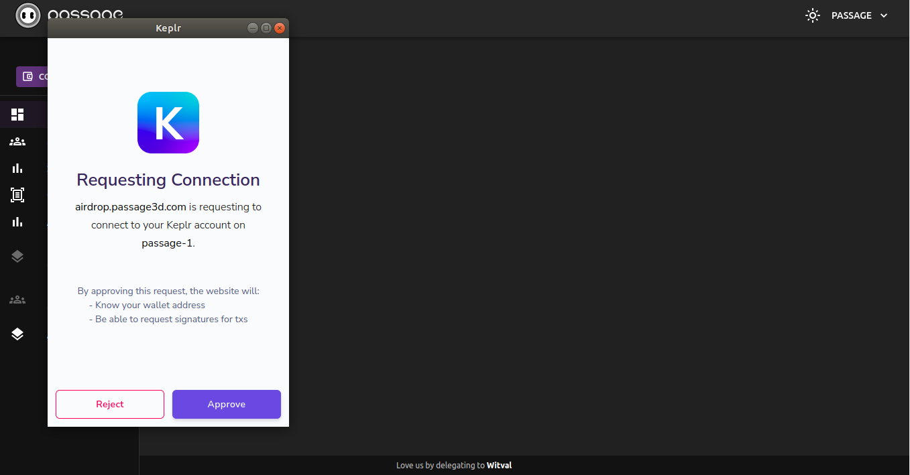

- [Done]
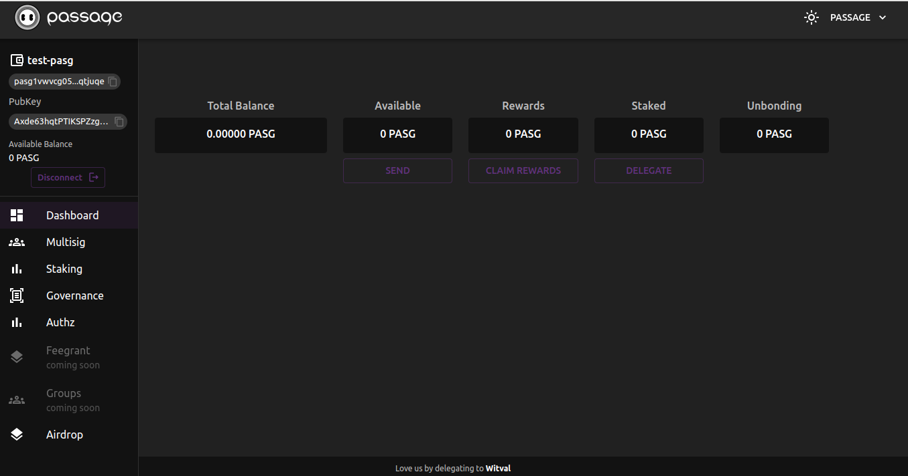

Now it will show you the address on the same page, that's your Passage3D address

- For any further actions using your `Passage` account like `Send`, you can go to the keplr wallet and select [Passage] in the dropdown window. It will show the balance details and `Send` option.

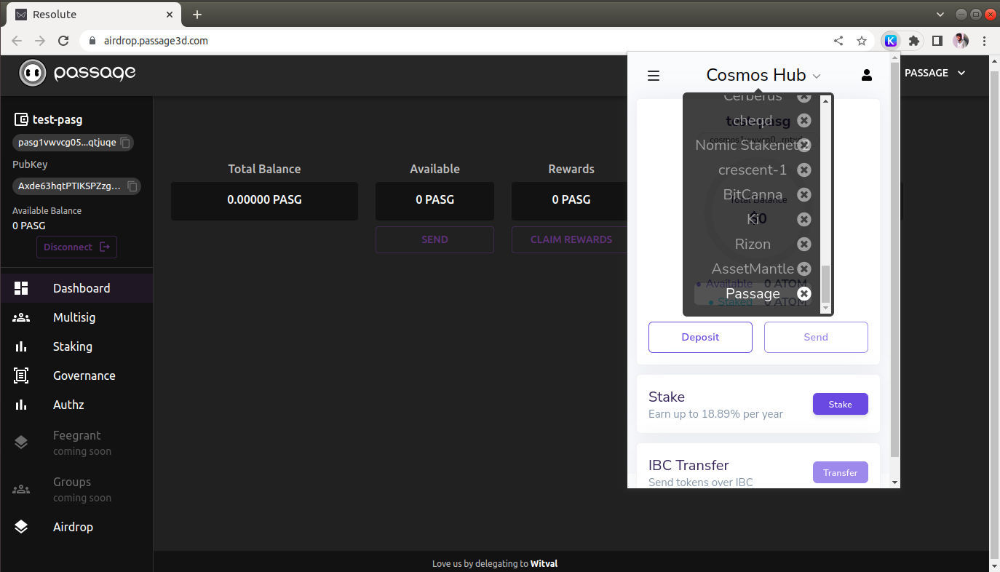
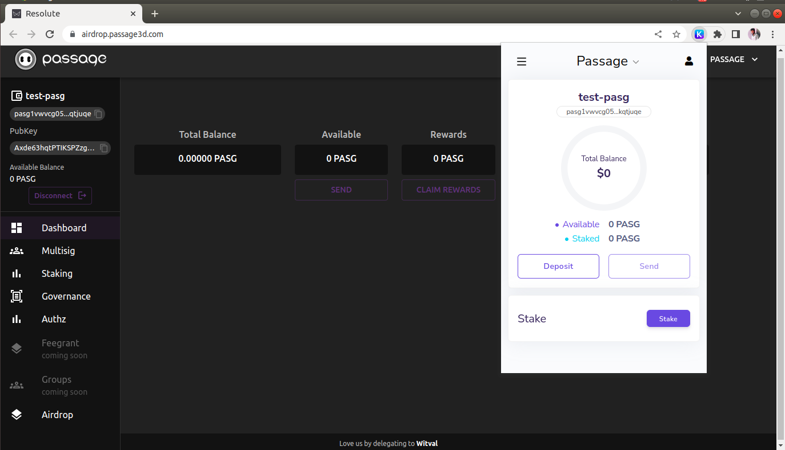
